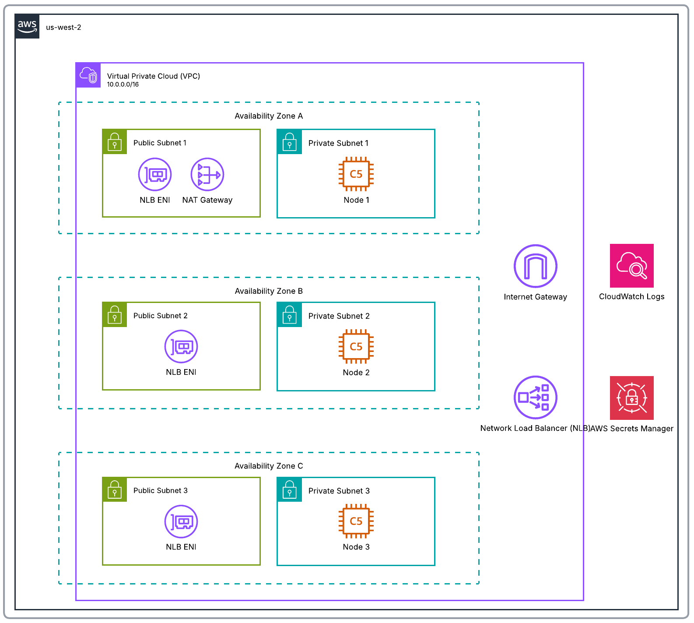

## USC DSCI-551 Course Project Spring 2026

Authors:

- Scott Enriquez
- Tingyin Deng
- Wen-Yen Hsu

## Folder `00-local`

**This is the folder that graders should use to run the code locally.** Many of the other directories (e.g.,
`01-single-region-cdk-cloud-deployment`) contain infrastructure-as-code (IaC) that requires AWS credentials to deploy
and incurs a cost. The team is happy to provide the grader with AWS credentials upon request. This folder
deploys containers locally for each system component and orchestrates with Docker Compose. Docker is the only software
dependency. Seed data is located in `00-local/db/sql/data.sql`.

To deploy, simply run:

```shell
cd 00-local
docker compose up --build
```

Once the containers are fully deployed, the application is available at `http://localhost:3000`. Press `Ctrl + C` in the
terminal to gracefully exit.

## Configuring AWS Credentials

> [!WARNING]
> All code past this point requires AWS credentials

Graders will be added to our AWS Organization via SSO. Please email one of the group members to do so. Follow the
steps in the `/documentation` folder for detailed instructions on how to configure them on your machine.

## Folder `01-single-region-cdk-cloud-deployment`

This is an AWS CDK application used to create the three-node cluster. Use the following commands to deploy:

```shell
cd 01-single-region-cdk-cloud-deployment
python3 -m venv '.venv'
. .venv/bin/activate
pip install -r requirements.txt requirements-dev.txt
# note that these require valid AWS credentials
cdk synth
cdk deploy
# when done
cdk destroy
```



## Folder `02-application-schema`

This contains the latest schema for the financial services application in `data.sql`. Sample data operations can be
found in `data.sql`.

## Folder `03-api-layer`

This directory contains the API layer for the financial services application. The Lambda functions are granted access to
Secrets Manager to pull the admin credentials. An API Gateway sits in front of the Lambda function for HTTP invocation.
Us the following commands to deploy:

```shell
cd 03-api-layer 
python3 -m venv '.venv'
. .venv/bin/activate
pip install -r requirements.txt requirements-dev.txt
# note that these require valid AWS credentials and 01 to be deployed
cdk synth
cdk deploy
# when done
cdk destroy
```

## Folder `04-application-frontend`

This directory contains the React web frontend and a CDK application to deploy the app to Amazon's CloudFront CDN.

```shell
cd 04-application-frontend 
python3 -m venv '.venv'
. .venv/bin/activate
pip install -r requirements.txt requirements-dev.txt
# note that these require valid AWS credentials and 01 and 03 to be deployed
cdk synth
cdk deploy
# when done
cdk destroy
```

## Folder `05-multi-region-cdk-deployment`

This is an AWS CDK application used to create the six-node cluster across two regions. Use the following commands to
deploy:

```shell
cd 05-multi-region-cdk-deployment
python3 -m venv '.venv'
. .venv/bin/activate
pip install -r requirements.txt requirements-dev.txt
# note that these require valid AWS credentials
cdk synth
cdk deploy --all 
# when done
cdk destroy
```

## Folder `06-distributed-acid-testing`

These are Python scripts to test read-after-write and read-during-write with the multi-region cluster. Script output are
contained in `.txt` files in this directory.

```shell
cd 05-multi-region-cdk-deployment
python3 -m venv '.venv'
. .venv/bin/activate
pip install -r requirements.txt 
# note that these require valid AWS credentials and 05 to be deployed
python cross_region_read_after_write.py 
python cross_region_read_during_write.py
```