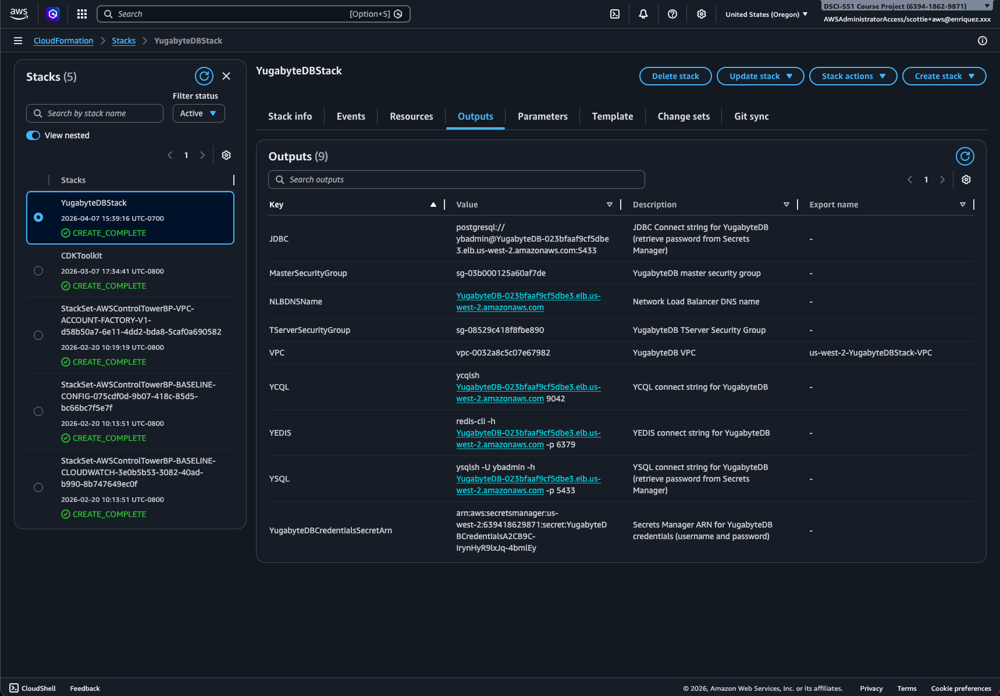
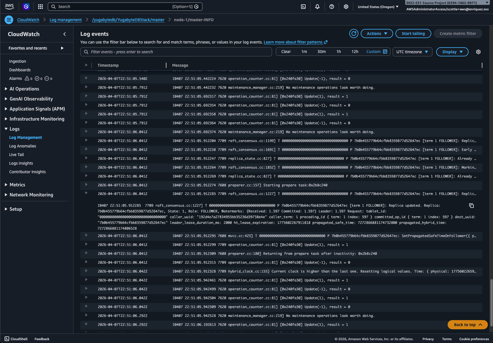

## Connecting to the Database

- Use the CloudFormation outputs to obtain the load balancer URL
- Navigate to
  the [Secrets Manager service](https://us-west-2.console.aws.amazon.com/secretsmanager/listsecrets?region=us-west-2) in
  the AWS Console to pull the admin account's password
- Connect via a PostgreSQL client (e.g., JetBrains DataGrip)

## Viewing Logs

- Navigate
  to [CloudWatch log groups](https://us-west-2.console.aws.amazon.com/cloudwatch/home?region=us-west-2#logsV2:log-groups)
  in the AWS Console
- For master logs, see `/yugabytedb/YugabyteDBStack/master`
- For tablet server logs, see `/yugabytedb/YugabyteDBStack/tserver`
- For query logs, see `/yugabytedb/YugabyteDBStack/ysql`