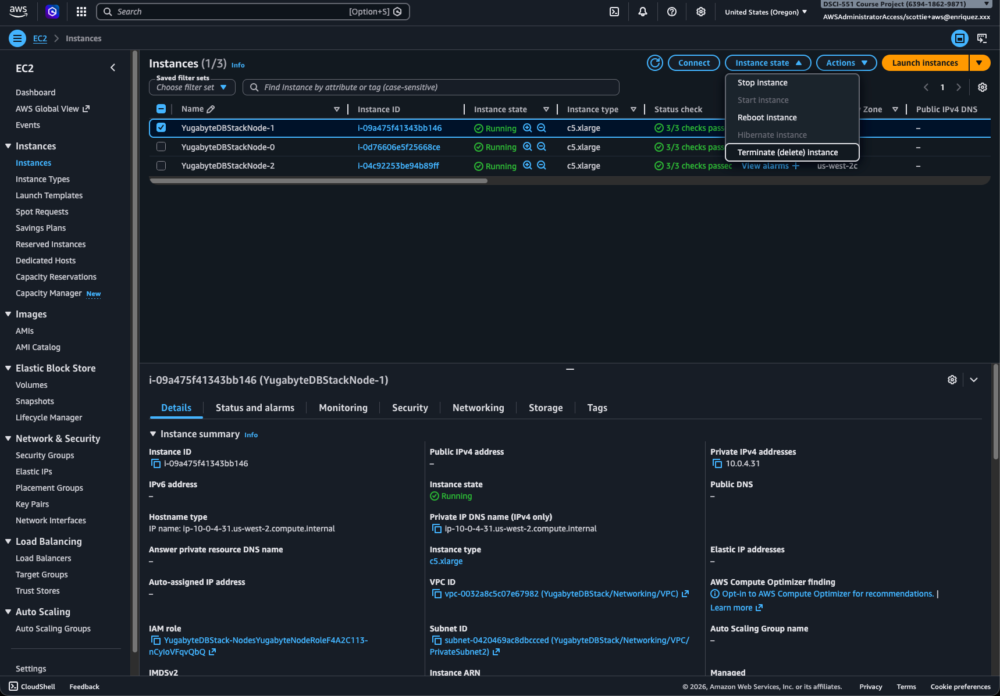

## Terminating an EC2 Instance

- To simulate a failure, navigate to
  the [EC2 service](https://us-west-2.console.aws.amazon.com/ec2/home?region=us-west-2#Instances:) in the AWS Console
- Terminate an instance at random
- Observe the master and tablet service logs

## Understanding Node Configuration

- Start by reviewing the Bash scripts in the `01-single-region-cdk-cloud-deployment/YugabyteDB/node-scripts` directory